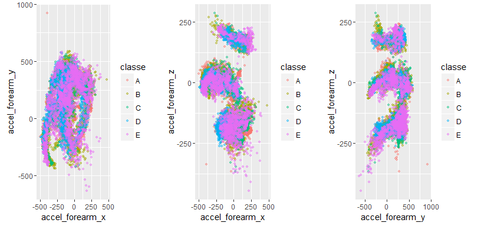
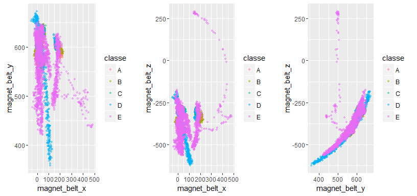

#**Human Activity Recognition (HAR) using Machine Learning Methods**#
##Course Project - Practical Machine Learning
####**Sarmilan, December 24, 2016**####

### Overview
Human Activity Recognition (HAR) and Pattern Discovery are becoming popular in pervasive computing because it can be applied to many real-life, human-centric problems. In this study, Weight Lifting Exercises dataset is used to investigate "how (well)" an activity was performed by the wearer.

The goal of the study is to use the data from accelerometers on the belt, forearm, arm, and dumbell of 6 participants to buitd a model, and use the model to classify their performances for a new test cases.

This report is submitted as the Course Project of Practical Machine Learning of Data Science Specialisation offered by John Hopskin University via Coursera. More information about the study and the data for this project come from this source: http://groupware.les.inf.puc-rio.br/har

### Dataset
Six young health participants were asked to perform one set of 10 repetitions of the Unilateral Dumbbell Biceps Curl in five different fashions: exactly according to the specification (Class A), throwing the elbows to the front (Class B), lifting the dumbbell only halfway (Class C), lowering the dumbbell only halfway (Class D) and throwing the hips to the front (Class E). More than hundred variables were collected and saved in the dataset when they perform the above activities.

## Data pre-processing
### Reading the data
This part reads the training data from the CSV file into the R environment and print the dimension.


```r
dataFull <- read.csv("./Data/pml-training.csv", na.strings=c("NA","#DIV/0!",""))
dim(dataFull)
```

```
## [1] 19622   160
```

### Cleaning the dataset
As many variables in the dataset have missing values, columns which are useful and can be used to predict the 'Class' are filtered and transferred to a new dataset for analysis purposes.

```r
nas <- 0
for(i in 1 : length(dataFull)) {
if (sum(is.na(dataFull[,i])) == '0') {
  nas[i] <- i
}
  else {
    nas[i] <- 0
  }
}

dataNew <- dataFull[nas]
dataFin <- dataNew[,-(1:7)]
dim(dataFin)
```

```
## [1] 19622    53
```
The variable numbers became 53 now.

## Cross Validation
The dataset is divided into 02 major parts to train the model, and to test the madel's performance on a new dataset respectively.

```r
library(caret)

set.seed(32323)
inTrain <- createDataPartition(dataFin$classe, p=0.65, list = FALSE)
training <- dataFin[inTrain,]
testing <- dataFin[-inTrain,]
dim(training); dim(testing)
```

```
## [1] 12757    53
```

```
## [1] 6865   53
```


## Descriptive Analysis
This part contains some plots to give visual understanding about the distribution of variables and its contribution towards distinguishing the 'Classe' variable.

**Acceleration of forearm in all 03 directions**
<!-- -->

**Magnet belt movements in all 03 directions**
<!-- -->

Above scatter plots illustrates how some variables have features which distinguish the 'Classe' variable in this study.

## Applying Machine Learning Techniques

In this part, some Machine Learning Techniques were applied and tested its accuracy over the Test dataset. Since the Predictor variable is a qualitative variable, Tree-based classification methods were considered and tested.

**Recursive partitioning method for classification**

Recursive partitioning for classification, regression and survival trees is applied first;

```r
library("rpart")
fit_rp <- rpart(classe ~., data=training, method="class")
pred_rp  <- predict(fit_rp, testing, type="class")
res_rp <- confusionMatrix(pred_rp,testing$classe)
res_rp$overall[c("Accuracy", "Kappa", "AccuracyPValue")]
```

```
##       Accuracy          Kappa AccuracyPValue 
##      0.7456664      0.6777599      0.0000000
```
Since its Accuracy is 0.7456664 and the Kappa is 0.6777599, another Tree-based method is tested in this study which is 'Random Forest'.

**Random Forest Method**

```r
library(randomForest)
fit_rf <- randomForest(classe ~., data=training, type="class")
pred_rf <- predict(fit_rf, testing, type="class")
res_rf <- confusionMatrix(pred_rf,testing$classe)
res_rf$overall[c("Accuracy", "Kappa", "AccuracyPValue")]
```

```
##       Accuracy          Kappa AccuracyPValue 
##      0.9932993      0.9915225      0.0000000
```
Eventhough the method is time consuming and computationaly costy, which gives a good accuracy over our Test dataset. As the above method classifies the predictor variable with 0.9932993 of accuracy and gives 0.9915225 Kappa, which method is selected to predict the test cases given by the instructors.

## Testing the Model
The above Model was applied to the Test cases given and the predicted results are;

```r
testCase <- read.csv("./Data/pml-testing.csv", na.strings=c("NA","#DIV/0!",""))
predict(fit_rf, testCase, type="class")
```

```
##  1  2  3  4  5  6  7  8  9 10 11 12 13 14 15 16 17 18 19 20 
##  B  A  B  A  A  E  D  B  A  A  B  C  B  A  E  E  A  B  B  B 
## Levels: A B C D E
```

As the predictor variable (Classe) has 05 categories, Tree-based method was considered in this study as a best algorithm for the classification. And as the 'rpart' method did not perform as expected in this study even its simple and interpretable, the Random Forest Method was selected to classify the predictor variable. Since Accuracy and Kappa showed a good value, Random Forest based model was selected in this study.
